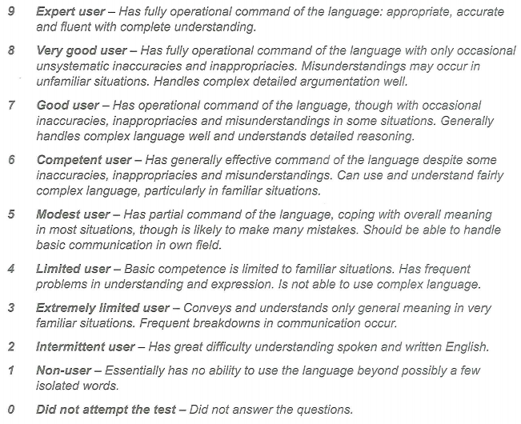

## Academic Test Format

### Listening

- Part 1
  - 10 questions
  - concerned with social needs
  - conversation between two speakers
- Part 2
  - 10 questions
  - concerned with social needs
  - monologue
- Part 3
  - 10 questions
  - concerned with situations related to educational or training contexts
  - conversation between up to four people
- Part 4
  - 10 questions
  - concerned with situations related to educational or training contexts
  - monologue

Question Types

- Multiple choice
- Matching
- Plan/map/diagram labelling
- Form completion
- Note completion
- Table completion
- Flowchart completion
- Summary completion
- Sentence completion
- Short-answer questions

### Reading

- Section 1
- Section 2
- Section 3

Contents

- 3 Texts 
  - taken from journals, books, magazines and newspapers
  - Topics of general interest
  - At least one text contains detailed logical argument
- Question Types
  - Multiple choice
  - Matching
    - information
    - headings
    - features
    - Sentence endings
  - Identifying information (True/False/Not Given)
  - Identifying the writer's views/claims (Yes/No/Not Given)
  - Completion
    - Sentence
    - Summary
    - Note
    - Table
    - Flowchart
    - Diagram-label
    - Short-answer

### Writing

- Task 1
  - Take 20 minutes
  - write at least 150 words
  - requires
    - look at a diagram or some data
    - Present the information in their own words
  - Assessed by
    - organise, present and possibly compare data
    - describe the stages of a process
    - describe an object or event
    - explain how something works
- Task 2
  - Take 40 minutes
  - write at least 250 words
  - Twice the score of Task 1
  - requires
    - presented with a point of view, argument or problem
  - Assessed by
    - Present a solution to the problem
    - present and justify an opinion
    - Compare and contrast evidence and opinions
    - Evaluate and challenge ideas, evidence or arguments

**Focuse ON**

- Writing in an appropriate style
- Writing assessment criteria

### Speaking

- Part 1
  - 4 - 5 minutes
  - Introduce yourself
  - Answer general questions
    - home/family
    - Job/studies
    - Interests and similar topic areas
- Part 2
  - Given a task card with prompts, talk on a particular topic
  - 1 minute to prepare, make some notes if they wish
  - speak for 1 - 2 minutes, the examiner asks 1 or 2 questions on the same topic
- Part 3
  - engaged in a discussion of more abstract issues
    - thematically linked to the topic in Part 2
  - Last for 4 - 5 minutes

Process

- Takes between 11 and 14 minutes
- conducted by a trained examiner
- assessed whether candidates can communicate effectively in English
  - Fluency and Coherence
  - Lexical Resource
  - Grammatical Range and Accuracy
  - Pronunciation
- Speaking assessment criteria is availabel at ielts.org

### How is IELTS Scored

# 17

## Test1

### Listenning

- 看题时间不是很充裕，只有看题目的时间
- 声音顺序严格按照题目的顺序
- 填词一定是语音中出现的词汇

#### part1

- 音频：www.cambridge.org/ELT_IELTS17_t1_audio1

1. litter
2. dogs
3. insects
4. butterflies
5. wall
6. island
7. boots
8. beginners
9. spoons
10. 35

#### part2

- 音频：www.cambridge.org/ELT_IELTS17_t1_audio2

11. A
12. C
13. A  -> B
14. B
15. A 
16. B  -> D
17. B 
18. C
19. D 
20. E

#### part3

- 音频：www.cambridge.org/ELT_IELTS17_t1_audio3

21. B  -> A
22. B
23. B
24. B  -> A
25. C
26. C
27. A
28. E
29. F
30. C

#### part4

- 音频：www.cambridge.org/ELT_IELTS17_t1_audio4

31. puzzle
32. logic
33. confusion
34. meditation
35. stone
36. coins
37. tree
38. breathing
39. paper
40. anxiety

### Reading

